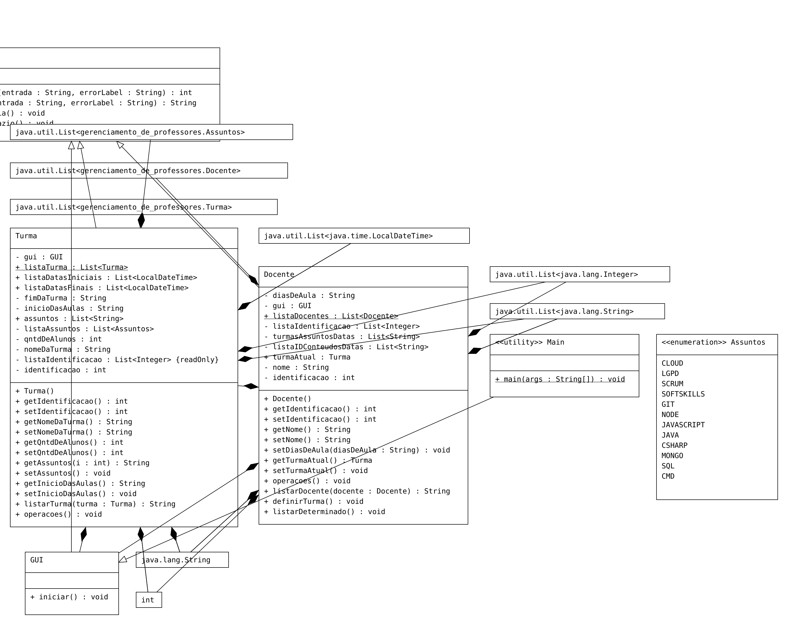

# Gerenciamento de Professores

> Segundo projeto de Férias da **TECH-DIVE**, um gerenciamento de docentes e cadastro de turmas.

## Objetivo:

O projeto consiste no controle de Turmas e Docentes, podendo cadastrá-los, delegar turma para determinado docente,
definir assuntos para cada turma e suas respectivas semanas de aula.

## Estruturação:

O projeto contém os seguintes componentes:

- **Enum Assuntos** - Para delimitar a escolha dos assuntos de cada turma dentre estes já definidos;

- **Classe GUI** - Controla a interface (criada com JOptionPane) de Inicializaação e encerramento do projeto. 
Mostrando uma interface com as seguintes opções:
  - **Cadastrar Turma** - Cria uma instância da classe Turma;
  - **Cadastrar Docente** - Cria uma instância da classe Docente;
  - **Sair** -  Encerra a execução do projeto.
  

- **Classe Validacao** - Valida a entrada de dados numérica e/ou vazia do usuário;

- **Classe Turma** - contém informações de cada turma criada, como nome, identificação, assuntos e nº de alunos,
contendo os seguintes métodos:

  - **Cadastrar Assunto** - adiciona um assunto à turma, caso não exceda a data de encerramento da turma;
  - **Listar turmas** -  Lista todass as turmas criadas com os seus respectivos dados;
  - **Voltar** - volta à interface criada pela GUI.
  
- **Classe Docente** - contém informações de cada docente, como nome, turma Atual, identificação e os seguintes métodos:

  - **Definir docente para determinada turma** - Adiciona o docente selecionado à uma turma, caso exista alguma
  ou não exceda mais de 2 docentes por turma;
  - **Listar todos os docentes**;
  - **Listar determinado docente**;
  - **Voltar** - volta à interface criada pela GUI.

- **Classe Main** - Classe principal para execução da aplicação.

## Especificações do Projeto:

**1.** A turma deverá ter uma duração de um ano;

**2.** Cada turma poderá ter, ao máximo, 2 docentes por assunto;

**3.** Um docente pode optar por ministrar mais de uma turma, desde que não entre em conflito com
os dias das semanas de turma já definidas;

**4.** Quando uma turma tiver um docente em determinado assunto, ele automáticamente cobrirá a semana inteira de aula.

**5.** Caso uma turma tenha mais de um docente em determinado assunto, um docente ficará om as quartas, quintas e sextas
enquanto o outro ficará com as segundas e terças.